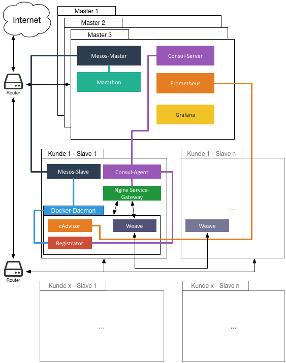

# Overview

This repository is used to install a working Mesos-Cluster with Marathon and some extra tools for using in production. SaltStack will be used to perform the installation. So one node will be a SaltStack master, all other nodes will be minions. There are going to be two different roles: A master role (must not be the SaltStack master) for performing cluster actions, a slave role for running Docker containers.



The following software will be installed:

Role Master:

- [Zookeeper](https://open.mesosphere.com/getting-started/datacenter/install/)
- [Mesos-Master](https://open.mesosphere.com/getting-started/datacenter/install/)
- [Marathon](https://open.mesosphere.com/getting-started/datacenter/install/)
- [Consul](https://www.consul.io/)

Role Slave:

- [Mesos-Slave](https://open.mesosphere.com/getting-started/datacenter/install/)
- [Docker](https://www.docker.com/)
- [cAdvisor](https://github.com/google/cadvisor) for exporting metrics to prometheus ([marmelatze/cadvisor](https://registry.hub.docker.com/u/marmelatze/cadvisor/) is used until https://github.com/google/cadvisor/pull/780 is merged)
- [Registrator](https://github.com/gliderlabs/registrator) for registering services with Consul. ([Marmelatze/registrator](https://github.com/Marmelatze/registrator) is used until https://github.com/gliderlabs/registrator/pull/149 is merged)
- [Weave](http://weave.works/) for providing a overlay network between the containers


# Setup

First you will need a Salt-Master to coordinate all Salt-Minions. Then you need a an odd number of master servers (3, 5, 7 ...). One of them can also be used as Salt-Master. The other master servers will be minions then.


## Salt-Master-Setup:

Combined setup for master and minion:

```
curl -L https://bootstrap.saltstack.com -o install_salt.sh
sudo sh install_salt.sh -U -M -P -A localhost
```

Clone this repository to /srv/salt:

```
sudo git clone https://github.com/Marmelatze/saltstack-mesos-test /srv/salt
```

Change the config of the Salt-Master:

```yaml
#/etc/salt/master

file_roots:
  base:
    - /srv/salt/salt
# ...
pillar_roots:
  base:
    - /srv/salt/pillar
```

Restart the master:

```
sudo service salt-master restart
```

You also have to change the minion config as described in the next section. The minion setup can be skipped, as it was already done previously.

## Minion-Setup

Nur den Minion installieren ohne Master (nicht nötig, wenn Master installiert wurde):

Install the Minion:

```
curl -L https://bootstrap.saltstack.com -o install_salt.sh
sudo sh install_salt.sh -U -A IP_MASTERS
```

Add the following to the end of the minion config:

```yaml
# /etc/salt/minion

# ...
mine_interval: 5
mine_functions:
  network.ip_addrs:
    interface: eth0
  zookeeper:
    - mine_function: pillar.get
    - zookeeper
```

Change the salt-grains. You have to select a numerical ID for each node (starting from 1). The `customer_id` can be ommitted if not needed. It will add a attribute to the mesos slave, so you can constraint an application to slaves of this customer. The combination of `host_id` and `customer_id` need to be unique and it will be used as IP subnet of the node (e.g. 10.3.2.0/24 for host_id=2 and customer_id=3).

```
# /etc/salt/grains

# Customer-Id this host is assigned to (numeric)-
customer_id: 0
# ID of this host.
host_id: ID

 # ID for zookeeper, only needed for masters.
zk_id: ID

# Available roles are master and slave. A node can use both.
roles:
- master
- slave
```

Restart the minion:

```
sudo service salt-minion restart
```

SaltStack uses a public-key authentication, so you need to accept the newly created minion on the master.

```
sudo salt-key -A
```

## Run SaltStack

After the Minions have been setup run SaltStack.

```
sudo salt '*' state.highstate
```


# Monitoring

Monitoring is done with Prometheus and Grafana. With the sample config the Grafana settings are stored in a MySQL database. So you have to setup a MySQL database or delete the corresponding settings from monitoring/marathon.json.

In order to make MySQL available in the consul service discovery you need to add a service config to consul. It is recommended to install a consul agent to the same server and join it to the cluster (see [docs](https://www.consul.io/docs/agent/services.html) for more details and options).

```json
# /etc/consul/server/mysql.json

{
    "service": {
        "name": "mysql",
        "port": 3306,
        "tags": ["customer-0"]
    }
}
```

The tag `customer-0` is used to distinguish global services from customer services. Customer 0 is the global customer and his services are available on all nodes.

Create a grafana database and a user:

```sql
CREATE DATABASE grafana;
CREATE USER 'grafana'@'%' IDENTIFIED BY 'grafana';
GRANT ALL PRIVILEGES ON grafana.* TO 'grafana'@'%';
FLUSH PRIVILEGES;
```

To add monitoring services (Prometheus, Grafana) execute the following on the salt-master assuming you cloned the repository to /srv/salt. This will add the prometheus config to consul and create a marathon group:

```bash
cd /srv/salt/monitoring
CONSUL_HOST=http://localhost:8500
MARATHON_HOST=http://localhost:8080
curl -X PUT -s --data-binary "@config_prometheus.yml" $CONSUL_HOST/v1/kv/config/prometheus
curl -X PUT -s --data-binary "@proxy_mysql.json" $CONSUL_HOST/v1/kv/proxy/tcp/mysql
curl -X PUT -s --data-binary "@proxy_prometheus.json" $CONSUL_HOSTv1/kv/proxy/web/prometheus
curl -X PUT -s --data-binary "@proxy_grafana.json" $CONSUL_HOST/v1/kv/proxy/web/grafana
curl -X PUT -s -H "Content-Type:application/json" --data "@marathon.json" $MARATHON_HOST/v2/groups/monitoring
```

Prometheus will be accessible at port 9090 and the Grafana dashboard at port 3000. The default credentials for grafana are (admin/install). You will have to create a Prometheus data source in Grafana first.

Configure it like the following:

* Name: Prometheus
* Type: Prometheus
* Default: true
* URL: `http://gateway:9090`
* Access: proxy
* Basic-Auth: false

A example dashboard is located at [monitoring/dashboard.json](monitoring/dashboard.json) and can be imported in Grafana.

# Service Gateway

The service gateway provides access from containers to services provided by other containers or external services. The configuration is managed in the key value storage from consul. Changes will be pulled by [Consul-Template](https://github.com/hashicorp/consul-template) and will form a nginx config. Each service gets a separate config file at `/proxy/<type>/<service>` (See [here](salt/consul/templates/templates) for the templates). There are three proxy types:

* HTTP reverse proxy (located in `/proxy/http/<service>`): This type will redirect all incomming traffic on a specific port to the service. Configuration:

  ```json
  {
    "service": "grafana",
    "servicePort": 3000,
    "containerPort": 3000,
    "timeout": 60,
    "external": true
  }
  ```

  * `service`: Name of the service, as its stored in consul.
  * `containerPort`: The port used in the container.
  * `servicePort`: The port exposed by the service gateway.
  * `external` (Optional): Whether this service can be access from the outside or only by other containers. (Default: `false`)
  * `timeout` (Optional): When there is no response from the service within the given timeout, nginx will yield a 504 gateway timeout.

* Web reverse proxy (located in `/proxy/web/<service>`): Like the HTTP reverse proxy, but all services will use port 80 and be distinguished by the domain (e.g. `grafana.test.schub.local`)

  ```json
  {
    "service": "grafana",
    "containerPort": 3000,
    "domain": "dashboard",
    "timeout": 60,
    "external": true
  }
  ```

  * `service`: Name of the service, as its stored in consul.
  * `containerPort`: The port used in the container.
  * `domain`: The subdomain for this service.
  * `external` (Optional): Whether this service can be access from the outside or only by other containers. (Default: `false`)
  * `timeout` (Optional): When there is no response from the service within the given timeout, nginx will yield a 504 gateway timeout.

* TCP reverse proxy (located in `/proxy/tcp/<service>`): Like the HTTP reverse proxy, but can be used for any TCP based service.

  ```json
  {
    "service": "mysql",
    "servicePort": 3306,
    "containerPort": 3306,
    "external": false
  }
  ```

  * `service`: Name of the service, as its stored in consul.
  * `containerPort`: The port used in the container.
  * `servicePort`: The port exposed by the service gateway.
  * `external` (Optional): Whether this service can be access from the outside or only by other containers. (Default: `false`)


# Scaling Marathon Apps

Automatic scaling of marathon apps is done via https://github.com/Marmelatze/docker-controller.
To use it the marathon-scaler app must be run as marathon app itself:

```bash
cd /srv/salt/scaling
MARATHON_HOST=http://localhost:8080
curl -X PUT -s -H "Content-Type:application/json" --data "@marathon-scaler.json" $MARATHON_HOST/v2/apps/scaling
```
